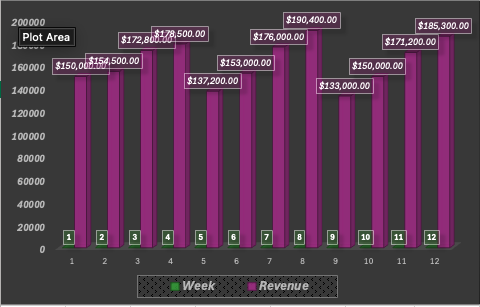
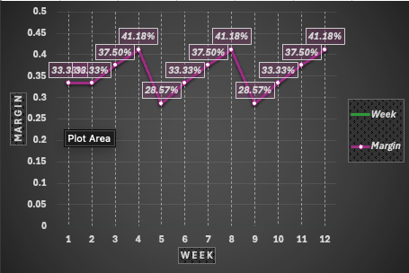

# Uber Revenue Optimization Model  
### Dynamic Pricing Case Study

Built using Excel (data modeling, KPI analysis, scenario analysis)

---

## Overview
This project models how pricing decisions impact demand, revenue, and profitability using Uber as a case study. The objective is to evaluate how pricing strategies can be optimized to maximize revenue while maintaining sufficient demand.

Data is based on modeled assumptions informed by real-world pricing and demand dynamics.

---

## Key Question
How can pricing be adjusted to maximize revenue without significantly reducing ride volume?

---

## Approach
- Built a structured Excel model using weekly ride data
- Calculated key performance metrics including revenue, cost, profit, and margin
- Conducted scenario analysis to evaluate pricing strategies
- Analyzed the relationship between price and demand

---

## Model Structure
The model is organized into four components:
- **Inputs** – simulated weekly data for trips, pricing, and costs  
- **Calculations** – revenue, profit, and margin analysis  
- **Scenarios** – comparison of different pricing strategies  
- **Decision** – insights and recommendations  

---

## Key Insight
Revenue is not maximized by increasing trip volume alone.  
The optimal outcome occurs when pricing is balanced with demand.

---

## Opportunity Identified
A static pricing approach may leave revenue on the table during periods of high demand.

---

## Recommendation
Introduce dynamic pricing adjustments during high-demand periods to increase revenue while maintaining sufficient ride volume.

---

## Expected Impact
- Increased revenue  
- Improved profit margins  
- More efficient demand utilization  

---

## Visualizations

### Revenue Trend

### Profit Margin Trend

## Files

[Download Full Excel Model](UberRevOptimization.xlsx)

---

## Tools Used
- Excel (data modeling, KPI analysis, scenario analysis)

---

## Summary
This project demonstrates how data can be used to move beyond analysis and support real business decisions. By modeling the relationship between pricing and demand, the framework identifies how revenue can be optimized through strategic pricing adjustments.
